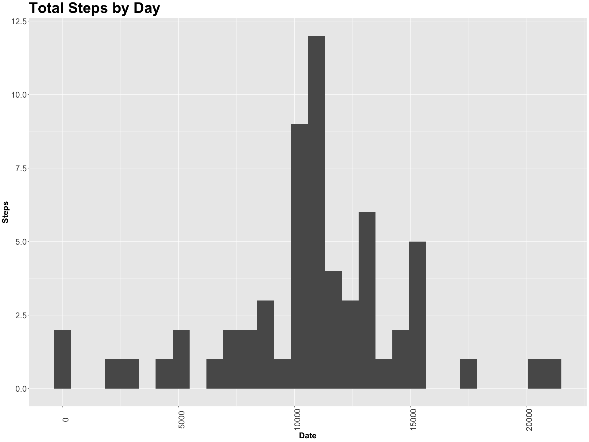

## Loading and preprocessing the data

```r
library(ggplot2)
unzip('activity.zip')
activity_data <- read.csv('activity.csv')
steps_per_date <- tapply(activity_data$steps, activity_data$date, sum)
steps_per_date <- data.frame(date=names(steps_per_date), steps=as.vector(steps_per_date))
```


## What is mean total number of steps taken per day?

```r
p <- ggplot(data=steps_per_date[!is.na(steps_per_date$steps),], aes(x=steps)) 
p <- p + geom_histogram() 
p <- p + xlab("Date")
p <- p + ylab("Steps")
p <- p + ggtitle("Total Steps by Day")
p <- p + theme(
  axis.text.x = element_text(angle = 90, size=20),
  axis.text.y = element_text(size=20),
  axis.title = element_text(size=20,face="bold"),
  title = element_text(size=30,face="bold"))
print(p)
```

```
## `stat_bin()` using `bins = 30`. Pick better value with `binwidth`.
```

<!-- -->

```r
summary(steps_per_date$steps)[3:4]
```

```
##   Median     Mean 
## 10765.00 10766.19
```


## What is the average daily activity pattern?


```r
steps_per_interval <- data.frame(interval=activity_data$interval, steps=activity_data$steps)
steps_per_interval <- steps_per_interval[complete.cases(steps_per_interval),]
steps_per_interval <- tapply(steps_per_interval$steps, steps_per_interval$interval, mean)
steps_per_interval <- data.frame(interval=as.factor(as.integer(names(steps_per_interval))), steps=as.vector(steps_per_interval))
p <- ggplot(data=steps_per_interval, aes(x=interval, y=steps, group=1))
p <- p + stat_summary(fun.y=mean, geom="line")
p <- p + xlab("Interval")
p <- p + ylab("Average Steps")
p <- p + ggtitle("Average Steps by Interval")
p <- p + theme(
  axis.text.x = element_text(angle = 90, size=20),
  axis.text.y = element_text(size=20),
  axis.title = element_text(size=20,face="bold"),
  title = element_text(size=30,face="bold"))
p <- p + scale_x_discrete(breaks = function(x) {x[c(TRUE, rep(FALSE, 5))]})
print(p)
```

<!-- -->

```r
max_interval = steps_per_interval[steps_per_interval$steps==max(steps_per_interval$steps), ]
max_interval
```

```
##     interval    steps
## 104      835 206.1698
```
The 835 interval has the highest average number of steps with 206.1698113 steps.

## Imputing missing values

```r
missing_count = sum(!complete.cases(activity_data))
missing_count
```

```
## [1] 2304
```

```r
# Impute missing values using the mean for the given interval.
imputed_activity_data <- activity_data
imputed_activity_data[is.na(imputed_activity_data$steps),]$steps <- steps_per_interval[match(imputed_activity_data[is.na(imputed_activity_data$steps),]$interval, steps_per_interval$interval), 2]

imputed_steps_per_date <- tapply(imputed_activity_data$steps, imputed_activity_data$date, sum)
imputed_steps_per_date <- data.frame(date=names(imputed_steps_per_date), steps=as.vector(imputed_steps_per_date))

p <- ggplot(data=imputed_steps_per_date, aes(x=steps)) 
p <- p + geom_histogram() 
p <- p + xlab("Date")
p <- p + ylab("Steps")
p <- p + ggtitle("Total Steps by Day")
p <- p + theme(
  axis.text.x = element_text(angle = 90, size=20),
  axis.text.y = element_text(size=20),
  axis.title = element_text(size=20,face="bold"),
  title = element_text(size=30,face="bold"))
print(p)
```

```
## `stat_bin()` using `bins = 30`. Pick better value with `binwidth`.
```

<!-- -->

```r
summary(imputed_steps_per_date$steps)[3:4]
```

```
##   Median     Mean 
## 10766.19 10766.19
```

There are 2304 rows with missing values in the dataset.


## Are there differences in activity patterns between weekdays and weekends?


```r
imputed_activity_data$weekend_or_weekday <- as.factor(as.vector(sapply(weekdays(as.Date(imputed_activity_data$date)), function(x) {if (x %in% c('Saturday', 'Sunday')) "weekend" else "weekday"})))
p <- ggplot(data=imputed_activity_data, aes(x=interval, y=steps))
p <- p + stat_summary(fun.y=mean, geom="line")
p <- p + facet_grid(weekend_or_weekday~.)
p <- p + xlab("Interval")
p <- p + ylab("Average Steps")
p <- p + ggtitle("Average Steps by Interval")
p <- p + theme(
  axis.text.x = element_text(angle = 90, size=20),
  strip.text = element_text(angle = 90, size=20),
  axis.text.y = element_text(size=20),
  axis.title = element_text(size=20,face="bold"),
  title = element_text(size=30,face="bold"))

print(p)
```

<!-- -->

